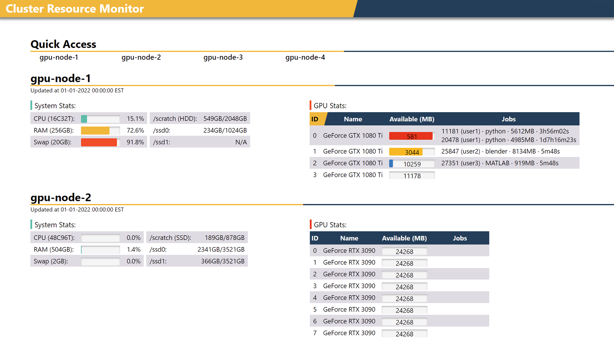

# MTCMon
A light-weight web-based resource monitor for GPU clusters.

- Visualize per-job GPU usage on the web
- Visualize CPU usage and other system information
- Responsive web design implemented with plain CSS and JavaScript, and is therefore lightweight
- Python-based with few dependencies
- Easy deployment without root privilege or Internet access
- Work for both centralized and distributed clusters
- Quick access bar designed for large clusters
- Already been deployed at labs in top universities like CMU, UC Berkeley, UT Austin and RWTH Aachen

## System requirement
The only requirement is that all nodes should be SSH-able from one of the nodes.

## Python dependency
Jinja2, Flask, psutil, nvidia-ml-py (Python2) or nvidia-ml-py3 (Python3).

## Deployment

1. Clone this repo and install the dependencies on all the nodes (or just the head node if all nodes share the same software environment through NFS).
1. Pick one of the nodes as the main node to collect stats from other nodes and host the website. In a centralized cluster, this is typically the head node. From this point on, all steps should take place on the main node.
1. Update your list of nodes in `node-list.txt`, and make sure you can ssh into all the listed nodes.
1. (Optionally) tweak the design of the web page by editing `index-design.html`.
1. Generate a web page template by running `python design2template.py` (the final web page will be rendered dynamically based on this template).
1. Run `run_monitor.sh` to dispatch monitors onto listed nodes
1. Run `python webserver.py <port>` to start the web server with a specified port
1. Go to `<hostname>:<port>/` and viola!

## Restart monitor daemons
Run `./kill_monitor.sh && ./run_monitor.sh` on the main node.

## Trouble shooting
Find the error log here: `/tmp/monitor-<node name>.log`

## Themes
Currently there are two themes:

 Yellow (default)

 Dark blue (checkout the `autobot` branch for this)
