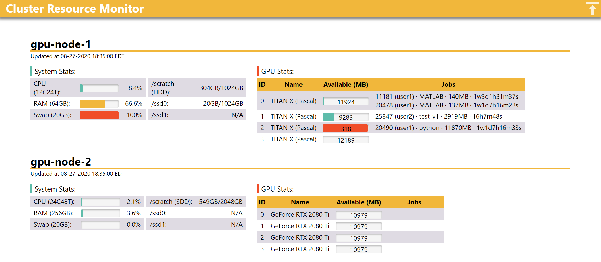

# Cluster Resource Monitor

### Dependency
* python packages: Jinja2, Flask, psutil, nvidia-ml-py (Python2) or nvidia-ml-py3 (Python3)
* **responsive** web design implemented with plain CSS and JavaScript, and is therefore lightweight and can be deployed without internet access
* tested with both Python 2 and 3

### Run it
1. Edit `node-list.txt` and make sure you can ssh into all the listed nodes 
2. Run `run_monitor.sh` to dispatch monitors onto listed nodes
3. Generate a web page template by running `python design2template.py` (note that the final web page will be generated with the latest info upon user request)
4. Run `python webserver.py <port>` to start the web server with a specified port
5. Go to `<hostname>:<port>/` and viola!

### Kill monitor daemons
Run `kill_monitor.sh`

### Trouble shooting
Find the error log here: /tmp/monitor-<node name>.log
